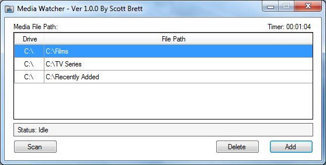
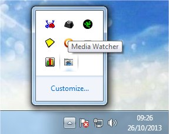

--------------------------------------------
Legacy Application - Created In Summer 2013:
--------------------------------------------

I designed and created this program (Back in 2013) to allow me to automate the daily task of restructuring my media folders in order for them to be compatible with programs such as Media Browser / XBMC. These applications require that media is contained in a specific tree like structure so that it can catalogue your collection and match it up correctly against content metadata.

Media Watcher will search user specified folders periodically for new media content (.MKV, .MP4, .AVI etc). If new content is found then it will create the folder, name it correctly and move the media to this location. The application can tell the difference between a movie file and a TV series by querying the naming scheme of the file. The application is designed to be run on machine start-up and will hide its GUI in the system tray and will only be made visible if the user double clicks on its icon. Multithreading is used to keep the GUI responsive when under heavy load and reduce the CPU usage of the application. The application will manually scan folders for media or periodically every five minutes.

Technologies / Principles Used:

- C#
- WinForms
- Multithreading
- Regular Expressions
- Windows Registry
- .NET Framework Ver 4.8 (Updated from ver 4.5 and originally created in Visual Studio 2013)
- Windows Desktop Application

Images:

